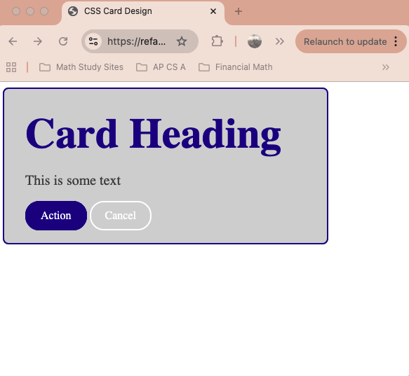

# css-card

## Learning Target
- I am learning how to use CSS descendant selectors and box-model properties to create a "card" component

## Success Criteria
- I can use a descendant selector such as ```.class tag``` to style child elements within a parent element
- I can use width, height, padding, margin, and border CSS properties to control the size of HTML elements
- I can style a "card" component using HTML and CSS

## Directions
1. Install Live Server and Go Live to view how the webpage looks with no styling
2. Create ```style.css``` and link it to ```index.html``` 
3. Follow along with my demonstration to review using CSS box-model properties to style the header

## Assignment
In ```index.html```, I have given you the necessary HTML to create a card component. Your job is to add the CSS style rules to make it look like the image below:  

1. Analyze the HTML in ```index.html```. Make note that there is a ```<div>``` with the class ```card```. There are four elements inside the div. Two of those elements have id's to help you style them specifically.
2. In your ```styles.css```, add a ```.card``` selector and some rules to style the entire card. You'll want to use the following
    - ```background-color```
    - ```width```
    - ```padding```
    - ```border-radius```
    - ```border```
3. Next, style the ```<h2>``` inside the card div. You should use a CSS descendant selector to target it like this: ```.card h2```